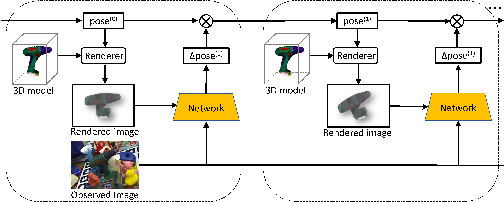
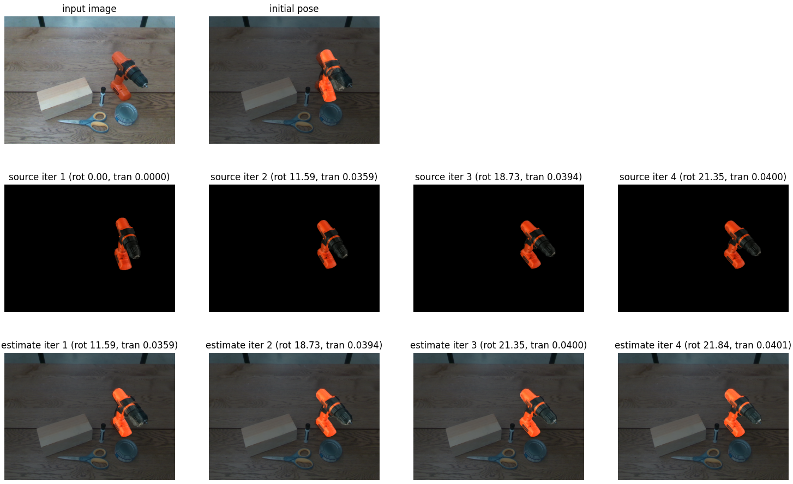

# DeepIM-PyTorch: A PyTorch Implementation of the DeepIM Framework for 6D Object Pose Estimation

### Introduction

We implement DeepIM in PyTorch in this project.

DeepIM is a deep neural network for 6D pose matching. Given an initial pose estimation, DeepIM is able to iteratively refine the pose by matching the rendered image against the observed image. The network is trained to predict a relative pose transformation using an untangled representation of 3D location and 3D orientation and an iterative training process. [pdf](https://yuxng.github.io/yili_eccv18.pdf), [Project](https://rse-lab.cs.washington.edu/projects/deepim/)

<p align="center"></p>

### License

DeepIM-PyTorch is released under the NVIDIA Source Code License (refer to the LICENSE file for details).

### Citation

If you find DeepIM useful in your research, please consider citing:

    @inproceedings{li2017deepim,
        Author = {Yi Li and Gu Wang and Xiangyang Ji and Yu Xiang and Dieter Fox},
        Title = {{DeepIM}: Deep Iterative Matching for {6D} Pose Estimation},
        booktitle = {European Conference Computer Vision (ECCV)},
        Year = {2018}
    }

### Required environment

- Ubuntu 16.04 or above
- PyTorch 0.4.1 or above
- CUDA 9.1 or above

### Installation

Use python3. If ROS is needed, compile with python2.

1. Install [PyTorch](https://pytorch.org/).

2. Install python packages
   ```Shell
   pip install -r requirement.txt
   ```

3. Initialize the submodules in ycb_render
   ```Shell
   git submodule update --init --recursive
   ```

4. Compile the point matching loss layer in $ROOT/lib.
    ```Shell
    cd $ROOT/lib/point_matching_loss
    sudo python setup.py install
    ```

5. Compile the ycb_render in $ROOT/ycb_render
    ```Shell
    cd $ROOT/ycb_render
    sudo python setup.py develop
    ```

### Download

- 3D models of YCB Objects we used [here](https://drive.google.com/file/d/1PTNmhd-eSq0fwSPv0nvQN8h_scR1v-UJ/view?usp=sharing) (3G). Save under $ROOT/data or use a symbol link.

- Our pre-trained checkpoints [here](https://drive.google.com/file/d/1iokU2LhQbF3kjHDqpb_I1WT1n_XBoQUm/view?usp=sharing) (3G). Save under $ROOT/data or use a symbol link.

### Running the demo

1. Download 3D models and our pre-trained checkpoints first.

2. run the following script
    ```Shell
    # testing on color
    ./experiments/scripts/demo.sh

    # testing on RGB-D
    ./experiments/scripts/demo_rgbd.sh
    ```

<p align="center"></p>

### Training your own models with synthetic data for YCB objects

1. Download background images, and save to $ROOT/data or use symbol links.
    - COCO 2014 images for training on RGB data [here](https://cocodataset.org/#download)
    - SUN RGB-D images for training on RGB-D data [here](https://rgbd.cs.princeton.edu/)
    - Or use your own background images.

2. Download the pre-trained FlowNetSimple weights from [here](https://drive.google.com/file/d/1WJ5icXXVEEwOcPeiOd4kM1ETdofnN0_l/view?usp=sharing) (148M). Put the weight file to $ROOT/data/checkpoints. If our pre-trained models are already downloaded, the FlowNetSimpe checkpoint should be in $ROOT/data/checkpoints already.

3. Training and testing for 20 YCB objects with synthetic data. Modify the configuration file for training on a subset of these objects.
    ```Shell
    cd $ROOT

    # multi-gpu training, we used 4 GPUs
    ./experiments/scripts/ycb_object_flow_train.sh

    # testing, $GPU_ID can be 0, 1, etc.
    ./experiments/scripts/ycb_object_flow_test.sh $GPU_ID

    ```

### Training and testing on the YCB-Video dataset

1. Download the YCB-Video dataset from [here](https://rse-lab.cs.washington.edu/projects/posecnn/).

2. Create a symlink for the YCB-Video dataset
    ```Shell
    cd $ROOT/data/YCB_Video
    ln -s $ycb_data data
    ```

3. Download the PoseCNN results on the keyframes from [here](https://drive.google.com/file/d/1OQ__c4BBv5wn8B3NgK80JfGOhxiCjWZj/view?usp=sharing). Save to $ROOT/data/YCB_Video.


4. Training and testing on the YCB-Video dataset
    ```Shell
    cd $ROOT

    # multiple GPU training, we used 4 GPUs
    ./experiments/scripts/ycb_video_flow_train.sh

    # testing, $GPU_ID can be 0, 1, etc.
    ./experiments/scripts/ycb_video_flow_test.sh $GPU_ID

    ```

### Running with ROS on a Realsense Camera for real-world pose estimation with PoseCNN

- Python2 is needed for ROS.

- Make sure our pretrained checkpoints are downloaded.

- Make sure PoseCNN is running to provide initial pose estimation to DeepIM.

```Shell
# start realsense
roslaunch realsense2_camera rs_aligned_depth.launch tf_prefix:=measured/camera

# start PoseCNN

# run deepim with color only, $GPU_ID can be 0, 1, etc.
./experiments/scripts/ros_ycb_object_test.sh $GPU_ID

# or run deepim with RGB-D, $GPU_ID can be 0, 1, etc.
./experiments/scripts/ros_ycb_object_rgbd_test.sh $GPU_ID

```
